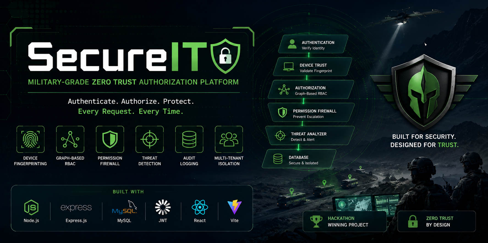
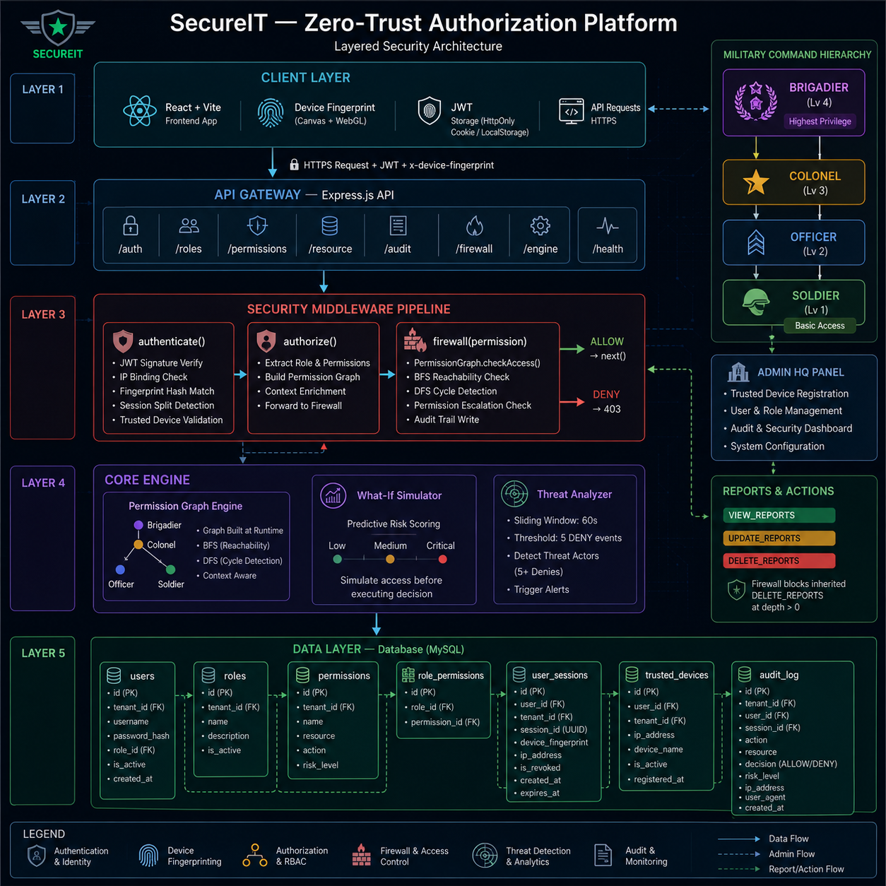

<h1 align="center">
 🛡️ SecureIT
</h1>

<div align="center">

### Military-Inspired Zero-Trust Security Subsystem

*A reusable authentication and authorization subsystem for enterprise & mission-critical applications.*

> 🏆 Originally built during a Hackathon


</div>

---

## 📖 Overview

SecureIT is a **military-themed Zero-Trust security subsystem** built to be integrated into larger enterprise and mission-critical applications.

Instead of stopping at authentication, SecureIT continuously validates **identity, device trust, authorization, tenant boundaries, and threat signals** before granting access.

### Core Security Pillars

- 🔐 Multi-Tenant Authentication
- 🖥 Hardware-Bound Sessions
- 🛡 Graph-Based RBAC
- 🚨 Permission Escalation Firewall
- 🏢 Multi-Tenant Isolation
- 🔒 Trusted Device Lockdown
- 📊 Threat Detection Dashboard
- 📝 Audit Logging

---

# ✨ Features

## 🔐 Multi-Tenant Authentication

- JWT Authentication
- bcrypt Password Hashing
- Session Tracking
- Active Session Validation
- Session Revocation
- Middleware Protection

---

## 🖥 Hardware Bound Sessions

SecureIT binds every JWT session to a hardware/browser fingerprint.

Security Flow

1. Generate secure nonce
2. SHA-256(deviceFingerprint + nonce)
3. Store fingerprint hash
4. Validate every request
5. Revoke session on mismatch

---

## 🛡 Graph Based RBAC

SecureIT represents roles as a directed graph.

Algorithms Used

### Breadth First Search

- Permission Resolution
- Shortest Inheritance Path

### Depth First Search

- Cycle Detection
- Graph Validation

Supports:

- Explainable permissions
- Risk analysis
- Permission inheritance

---

## 🚨 Permission Escalation Firewall

Instead of only checking *whether* a permission exists, SecureIT validates *how* it was obtained.

Checks include:

- Direct vs inherited permission
- Inheritance depth
- High-risk permission rules
- Tenant firewall policies

Violations are blocked before business logic executes.

---

## 🔒 Trusted Device Lockdown

Restricted accounts (Brigadier) can only authenticate from registered devices.

Validation:

- Registered IP
- Device Registry
- Active Status

Failure Result

```
DEVICE_LOCKDOWN_VIOLATION
```

---

## 🏢 Multi-Tenant Isolation

Every resource is tenant scoped.

SecureIT prevents:

- Cross tenant reads
- Cross tenant writes
- Cross tenant sharing
- Tenant impersonation

---

## 🚨 Threat Detection

The Threat Analyzer continuously scans authorization events.

Current Detection Rule

```
5 DENY events
within 60 seconds

↓

THREAT_ACTOR
```

Automatically

- Creates Audit Log
- Raises Critical Alert
- Displays Dashboard Warning

---

# 🪖 Military Command Hierarchy

```
Brigadier
    │
Colonel
    │
Officer
    │
Soldier
```

Higher ranks inherit permissions from lower ranks while remaining protected by firewall policies.

---

# 🏗 System Architecture



```text
docs/images/system-architecture.png
```

```
Client
   │
Authentication
   │
JWT Verification
   │
Device Fingerprint
   │
Trusted Device Check
   │
Permission Graph
   │
Permission Firewall
   │
Tenant Validation
   │
Audit Logger
   │
Threat Analyzer
   │
Database
```

---

# 💾 Database

Main Tables

- users
- roles
- permissions
- role_permissions
- tenants
- user_sessions
- trusted_devices
- firewall_rules
- audit_log
- resource_shares

---

# 📁 Project Structure

```text
SecureIT/
├── client/
├── server/
├── middleware/
├── routes/
├── controllers/
├── services/
├── utils/
├── models/
├── database/
├── docs/
├── README.md
└── .env.example
```

---

# 📡 API Overview

| Method | Endpoint | Purpose |
|---------|----------|---------|
| POST | /api/auth/login | Login |
| POST | /api/auth/logout | Logout |
| GET | /api/auth/me | Current User |
| GET | /api/resources | Fetch Resources |
| POST | /api/resources/share | Share Resource |
| GET | /api/audit | Audit Logs |
| GET | /api/threats | Threat Dashboard |

---

# ⚙ Installation

```bash
git clone https://github.com/imjoe77/secureIT.git

cd secureIT

npm install

npm run dev
```

---

# 🔑 Environment Variables

```env
PORT=

JWT_SECRET=

DB_HOST=

DB_PORT=

DB_USER=

DB_PASSWORD=

DB_NAME=

CLIENT_URL=
```

---

# 🧭 User Walkthrough

This section demonstrates how to explore every core feature of SecureIT.

---

## 🪖 Step 1 — Login

Use one of the demo accounts below.

| Role | Username | Password |
|------|----------|----------|
| Soldier | `soldier_user` | `password123` |
| Officer | `officer_user` | `password123` |
| Colonel | `colonel_user` | `password123` |
| Brigadier | `brigadier_user` | `password123` |

> ⚠ The Brigadier account requires a registered trusted device before login.

---

## 🔐 Step 2 — Authentication

After logging in:

- JWT Token is generated
- Session is created
- User Session is stored
- Device fingerprint is validated
- Tenant context is attached

If successful, the user is redirected to their dashboard.

---

## 🖥 Step 3 — Explore Role-Based Dashboards

Each military role has different permissions.

### Soldier

- View assigned resources
- Basic access only

### Officer

- Additional operational permissions
- Resource management

### Colonel

- Administrative permissions
- User oversight

### Brigadier

- Highest privilege
- Security administration
- Trusted Device Management

---

## 🕸 Step 4 — Test the Permission Graph

Navigate to the **Permission Graph** section.

Here you can:

- View role inheritance
- Inspect permission paths
- Observe BFS permission resolution
- Understand DFS cycle validation

---

## 🛡 Step 5 — Test the Permission Firewall

Attempt an operation beyond your assigned permissions.

Example:

- Login as Soldier
- Try deleting an administrative resource

Expected Result:

```
403 Forbidden
```

Audit Log:

```
PERMISSION_DENIED
```

---

## 🔒 Step 6 — Test Trusted Device Lockdown

Login using:

```
brigadier_user
```

If your IP has not been registered:

```
DEVICE_LOCKDOWN_VIOLATION
```

### Fix

Navigate to:

```
Admin HQ
↓

Trusted Devices

↓

Register Current Device
```

Try logging in again.

---

## 🖥 Step 7 — Test Hardware-Bound Sessions

Login normally.

Now copy your JWT and attempt to use it from another browser or device with a different fingerprint.

Expected Result

```
403 Forbidden
```

Audit Log

```
SESSION_SPLIT_DETECTED
```

The session is immediately revoked.

---

## 🏢 Step 8 — Test Multi-Tenant Isolation

Login as Tenant A.

Attempt to access resources belonging to Tenant B.

Expected Result

```
CROSS_TENANT_VIOLATION
```

No data is returned.

---

## 🚨 Step 9 — Trigger Threat Detection

Repeatedly perform unauthorized actions.

Example:

- Open a protected endpoint
- Refresh several times

After **5 denied requests within 60 seconds**, SecureIT automatically classifies the account as a threat actor.

Dashboard Event:

```
🚨 THREAT_ACTOR
```

Audit Log:

```
Critical Security Event
```

---

# ❗ Common Errors

| Error | Cause | Solution |
|---------|--------|----------|
| Invalid Credentials | Wrong username/password | Verify demo credentials |
| JWT Expired | Session expired | Login again |
| SESSION_SPLIT_DETECTED | Token used on another device | Login again |
| DEVICE_LOCKDOWN_VIOLATION | Device not trusted | Register current device in Admin HQ |
| PERMISSION_DENIED | Missing role permission | Login with higher role |
| CROSS_TENANT_VIOLATION | Attempted cross-tenant access | Use resources belonging to your tenant |
| THREAT_ACTOR | Too many denied requests | Wait before retrying or clear the session |

---

## 💡 Recommended Demo Flow

If you're exploring SecureIT for the first time, follow this order:

1. Login as **Soldier**
2. Explore the dashboard
3. Attempt an unauthorized action
4. View the Audit Log
5. Login as **Officer**
6. Compare available permissions
7. Login as **Colonel**
8. Observe inherited permissions
9. Register a trusted device
10. Login as **Brigadier**
11. Test device restrictions
12. Trigger threat detection
13. Explore the Permission Graph
14. Review the Security Dashboard

This walkthrough covers every major feature implemented in SecureIT.

---

# 🚀 Future Roadmap

- MFA Support
- OAuth2 / SSO
- WebAuthn Passkeys
- SIEM Integration
- Geolocation Risk Analysis
- Adaptive Authentication
- Email Alerts
- Docker Deployment
- Kubernetes Support
- Redis Session Cache
- PostgreSQL Support

---

# 🤝 Contributing

Contributions are welcome.

1. Fork the repository
2. Create a feature branch
3. Commit changes
4. Open a Pull Request

---

# 📄 License

Licensed under the MIT License.

See the LICENSE file for details. MIT License Template: https://opensource.org/licenses/MIT

---

# 👨‍💻 Author

**Nathaniel Bandi**

GitHub: https://github.com/imjoe77

---

<div align="center">

### ⭐ If you found SecureIT useful, consider giving the repository a star!

Built with ❤️ to demonstrate modern Zero-Trust security architecture.

</div>
